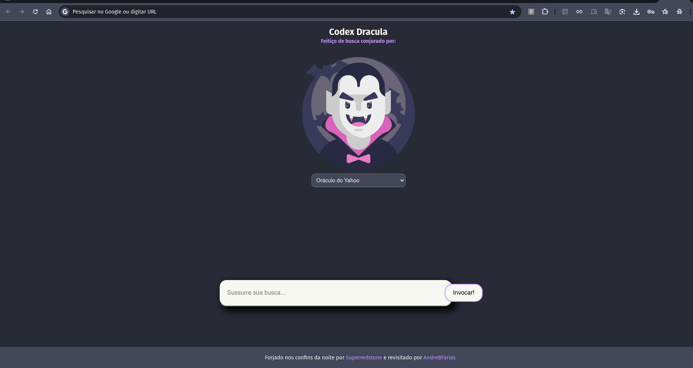

# Codex Dracula - New-tabs (PT-BR)

Uma reinterpretação sombria da extensão [Dracula New Tab](https://github.com/dracula/new-tabs), com uma estética arcana inspirada em grimórios mágicos, interface em português e um ritual de busca visualmente encantador.

## Preview



## Buscadores renomeados com estilo

- Olho de Google
- Oráculo de Yahoo
- Sussurros de Bing
- Pato das Trevas (Duckduckgo)
- Caçador Valente (Brave search)
- Espelho Qwant
- Ecos da Vida (Ecosia)

## O que tem de novo

- Visual reimaginado com tema gótico e referências a tomos mágicos
- Interface 100% localizada em português
- Efeitos sonoros ao buscar (sussurros)
- Imagem do Drácula centralizada com responsividade
- Ícones personalizados nos tamanhos 16, 48 e 128 para a extensão
- Código completamente movido para a raiz do repositório (sem pasta `/chrome`)

## Instalação no Chrome (ou navegadores Chromium)

### Via Git

```bash
git clone https://github.com/AndreBFarias/new-tabs.git
```

## Manual
- Baixe o repositório via Download ZIP
- Extraia os arquivos
- Acesse: chrome://extensions/
- Ative o Modo do desenvolvedor
- Clique em “Carregar sem compactação”
- Selecione a pasta extraída

# Créditos
Projeto original por @Superredstone

Tema Dracula por https://draculatheme.com

Versão Codex Dracula por @AndreBFarias

# Licença
Distribuído sob a licença GPL-2.0. Pode remixar, adaptar e redistribuir — desde que mantenha o código aberto.
