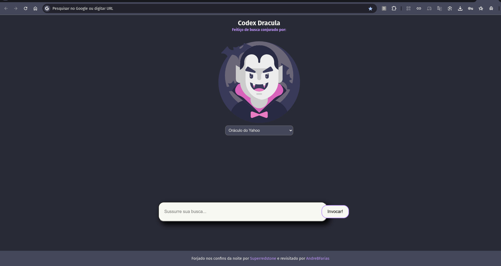

<div align="center">

[](#)
[](https://www.gnu.org/licenses/gpl-2.0)
[](https://github.com/AndreBFarias/new-tabs/stargazers)
[](https://github.com/AndreBFarias/new-tabs/issues)

<h1>Codex Dracula - New Tabs</h1>


</div>

---

Uma releitura sombria da extensão [Dracula New Tab](https://github.com/dracula/new-tabs), com uma estética arcana inspirada em grimórios mágicos, interface em português e um ritual de busca visualmente encantador.

---

## Descrição

Extensão para navegador que substitui a página de nova aba por uma interface temática inspirada no universo Dracula. Os motores de busca recebem nomes arcanos e a interface é totalmente localizada em português. Compatível com Chrome e Firefox via Manifest v2 e v3.

---

<div align="center">

</div>

---

## Buscadores renomeados

| Motor Original | Nome Arcano |
|----------------|-------------|
| Google | Olhos de Google |
| Yahoo | Oráculo do Yahoo |
| Bing | Sussurros do Bing |
| DuckDuckGo | Pato das Trevas |
| Brave Search | Caçador Valente |
| Qwant | Espelho de Qwant |
| Ecosia | Ecos da Vida |

## Novidades desta versão

- Visual reimaginado com tema gótico e referências a tomos mágicos
- Interface 100% localizada em português
- Efeitos sonoros ao buscar (sussurros) - agora com opção de ativar/desativar
- Imagem do Dracula centralizada com responsividade
- Ícones personalizados nos tamanhos 16, 48 e 128
- Suporte para Chrome e Firefox (Manifest v2 e v3)

---

## Instalação Rapida

### Linux / macOS
```bash
./install.sh
```

### Windows
```cmd
install.bat
```

Os instaladores apresentam um menu interativo para selecionar o navegador.

---

## Instalação Manual

### Chrome / Chromium / Edge / Brave / Vivaldi

| Arquivo | Descricao |
|---------|-----------|
| [codex-dracula-chrome-v2.1.zip](releases/chrome/) | Extensão para Chrome (Manifest v3) |

1. Baixe e extraia o arquivo `.zip`
2. Acesse `chrome://extensions/`
3. Ative o **Modo do desenvolvedor**
4. Clique em **Carregar sem compactacao**
5. Selecione a pasta extraida

---

### Firefox / Waterfox / LibreWolf

| Arquivo | Descricao |
|---------|-----------|
| [codex-dracula-firefox-v2-v2.1.xpi](releases/firefox/) | Firefox 57+ (Manifest v2) - Maior compatibilidade |
| [codex-dracula-firefox-v3-v2.1.xpi](releases/firefox-v3/) | Firefox 109+ (Manifest v3) - Versão moderna |

**Via arquivo .xpi:**
1. Baixe o arquivo `.xpi`
2. Acesse `about:addons`
3. Clique no ícone de engrenagem
4. Selecione **Instalar complemento a partir de arquivo**
5. Escolha o arquivo `.xpi` baixado

**Instalação temporaria (desenvolvimento):**
1. Acesse `about:debugging#/runtime/this-firefox`
2. Clique em **Carregar extensão temporaria**
3. Selecione o `manifest.json` da pasta desejada

---

## Compatibilidade

| Navegador | Versão | Status |
|-----------|--------|--------|
| Chrome | 88+ | Manifest v3 |
| Chromium | 88+ | Manifest v3 |
| Microsoft Edge | 88+ | Manifest v3 |
| Brave | 1.19+ | Manifest v3 |
| Vivaldi | 3.6+ | Manifest v3 |
| Opera | 74+ | Manifest v3 |
| Arc | Todas | Manifest v3 |
| Firefox | 57-108 | Manifest v2 |
| Firefox | 109+ | Manifest v2 ou v3 |
| Waterfox | G3+ | Manifest v2 |
| LibreWolf | Todas | Manifest v2 |
| Floorp | Todas | Manifest v2 |

---

## Estrutura do Projeto

```
new-tabs/
├── assets/              # Imagens e recursos
├── chrome/              # Extensão Chrome (Manifest v3)
├── firefox/             # Extensão Firefox (Manifest v2)
├── firefox-v3/          # Extensão Firefox (Manifest v3)
├── releases/
│   ├── chrome/          # .zip para Chrome
│   ├── firefox/         # .zip e .xpi (v2)
│   └── firefox-v3/      # .zip e .xpi (v3)
├── build.sh             # Build script (Linux/macOS)
├── install.sh           # Instalador (Linux/macOS)
├── install.bat          # Instalador (Windows)
├── README.md
├── INSTALL.md
└── LICENSE
```

---

## Build

Para gerar novos releases:

```bash
./build.sh
```

---

## Créditos

- Projeto original por [@Superredstone](https://github.com/Superredstone)
- Tema Dracula por [draculatheme.com](https://draculatheme.com)
- Versão Codex Dracula por [@AndreBFarias](https://github.com/AndreBFarias)

---

## Licença

Distribuído sob a licença GPL-2.0. Pode remixar, adaptar e redistribuir - desde que mantenha o código aberto.
