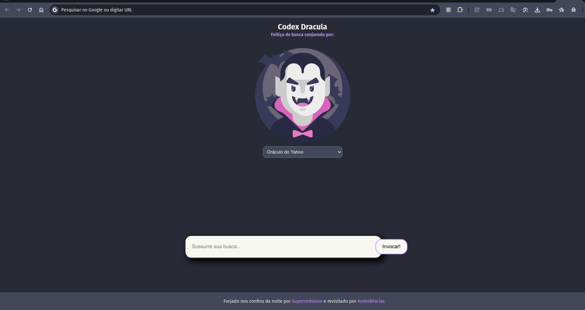

# Codex Dracula - New Tab (PT-BR)

Uma reinterpretação sombria e mística da extensão [Dracula New Tab](https://github.com/dracula/new-tabs), com foco em experiência visual, idioma português e uma interface inspirada em tomos arcanos e feitiços de busca.

---

##  Preview



---

##  Buscadores suportados

- Olho de Google
- Oráculo de Yahoo
- Sussurros de Bing
- Pato das Trevas (Duckduckgo)
- Caçador Valente (Brave search)
- Espelho Qwant
- Ecos da Vida (Ecosia)

---

## O que mudou?

- Visual totalmente reimaginado, baseado em **Codex Dracula**.
- Interface em **português brasileiro**, com nomes estilizados dos buscadores.
- **Campo de busca centralizado e responsivo**, com botão de invocação.
- **Áudio de sussurro** que toca antes de redirecionar para a busca.
- Suporte total a navegadores **baseados em Chromium** (Chrome, Edge, Brave, etc).

---

##  Como instalar

1. Clone o repositório com:


```bash
git clone https://github.com/AndreBFarias/codex-dracula-new-tab.git

```


2. Abra o navegador e acesse chrome://extensions/ 
3. Ative o Modo do Desenvolvedor (canto superior direito)
4. Clique em “Carregar sem compactação”
5. Selecione a pasta chrome/ do projeto

